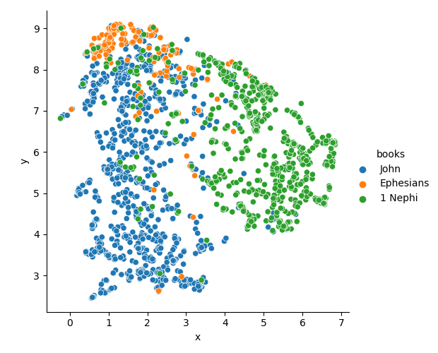

# A Machine Learning Exegesis of Ancient Scripture
## Purpose
Here we seek a better analysis of ancient scripture than what has hitherto been possible. To do this we utilize pretrained Natural Language models to process and interpret verses of scripture. As an example, pictured below are verses from three different books of scripture. These verses have been converted to vectors and subsequently projected by UMAP onto a 2-dimensional plane. It is seen that these deep learning models are able to identify authorship quite distinctly.

## Organization
This project is organized as follows:
- The datasets folder contains all of the json and csv versions of the different books of scripture
- The generation folder contains the different methods that we used to the texts and turn them into vectors. The most current is context_window.py. This folder also contains code for fine tuning models
- The models folder contains the fine tuned models, currently none have outperformed the base RoBERTa
- The processed_vectors folder contains the generated vectors for any of the models. The sentence_vectors.csv contains the vectors generated from the base RoBERTa while the contextual_vectors(2).csv contains the vectors for the context window RoBERTa.
- The analysis folder contains code for analyzing the resulting vectors.
- The plots folder contains different plots generated from the vectors.
## Generation
The vectors are generated using the roberta-v1-large sentence transformer. Initially we only converted individual verses to vectors (process_vectors.py), however this resulted in scriptures being taken highly out of context. To remedy this we ran a window around the desired verse through the transformer as well and then only pooled (summed) over the embeddings of the desired verse (e.g. instead of just "jesus wept" we use "And said, Where have ye laid him? They said unto him, Lord, come and see. Jesus wept.Then said the Jews, Behold how he loved him!" (John 11:34-36)). This helped to further distinguish chapters among books of scripture and also resulted in better contextual understanding (see examples)
## Fine Tuned Models
So far none of the fine tuning that we have done so far has resulted in a meaningful difference in separation or topic similarity fetching. We have fine tuned the model using ancient and modern text versions as examples of similarities (to make the model agnostic to king james language differences), but it resulted in little difference. 

We plan on fine tuning the model on various interpretations of individual verses (e.g. a verse and it's interpretation will be ranked as similar), but have only recently obtained the data for doing so.
## Analysis and Usage
To analyze the data we ran the transformed vectors through PCA to remove 10% of the variability in the data (usually resulting in a very large dimensionality reduction, this is good) and then ran the remaining vectors through UMAP (another dimensionality reduction technique that seeks to retain clusters within the data). We used cosine similarity as the dimensionality metric because it resulted in the most visible differences, but other methods such as euclidean distance could be used. Lastly we only ran these tests on subsets of the data (only 3-5 books) because when running all the books at once it becomes very difficult if not impossible to distinguish clusters (see plots/all_scriptures.png).

To modify which book subset you wish to use, just change the items in the list book_subset at the beginning of the file.

Additionally, finding scriptures that correlate with a specific topic is often a goal in scripture study. In cosine_sim.py we compare a given sentence with all verses of scripture (with the context window). This finds the scripture that is most related to the given sentence.

The given sentence is arbitrary, to change it just change the value of source in cosine_sim.py. Typically it is advised to keep the sentence relatively simple (e.g. don't use double negatives). However, the RoBERTa is very complex and in my preliminary useage of it has been able to capture somewhat complicated ideas.
## Examples of Context
To illustrate the benefit of the use of contextual vectors, we show the results of an experiment. When running "Your mom is angry with me" through the cosine_sim.py, using just the base non-contextual model, to obtain the most related scripture we get 1 Nephi 5:3 - "after this manner of language had my mother complained against my father". This scripture is definitely related to the given prompt, but we thought we could do better.

When running the same prompt through the contextual version we obtain Ezekiel 19:12 - "12 But she was plucked up in fury, she was cast down to the ground, and the east wind dried up her fruit: her strong rods were broken and withered; the fire consumed them." Which initially seems less related, but if you consider the surrounding verses we can see that it is actually talking about an angry mother as well, with perhaps a higher similarity: Ezekiel 19:10 "Thy mother is like a vine in thy blood, planted by the waters: she was fruitful and full of branches by reason of many waters."

## Size Notes
The files containing all of the generated vectors from context_window.py and process_vectors.py are not included due to the size restrictions in GitHub. These can be obtained by running the respective files on a GPU or a CPU if a GPU is not available. If a slurm command is needed, process.txt contains code for running the slurm files.
